# Excluded Diagrams

## 1) Pen-Paper Requirement Diagram
 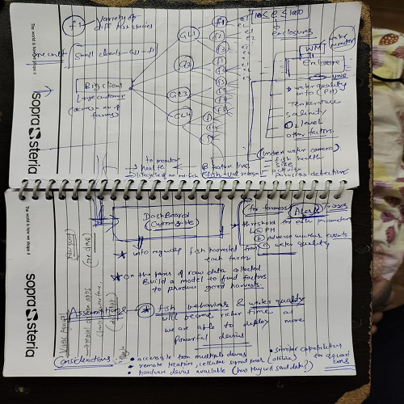 

 ## 2) Use Case 1 Diagram
 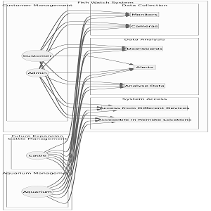 

 ## 3) Use Case 2 Diagram
 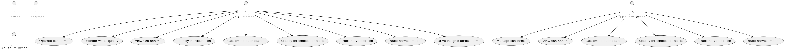 

 ## 4) Functional Diagram
 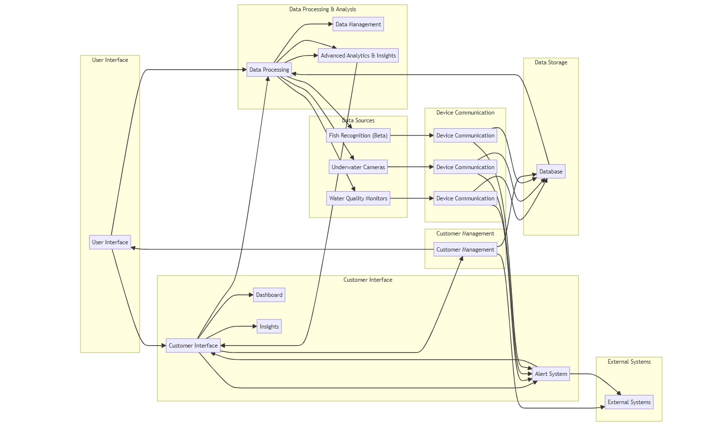 

 ## 5) Architecture Diagram
 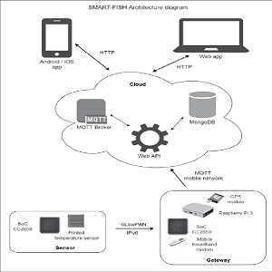 

 ## 6) Alert Mechanism Diagram
 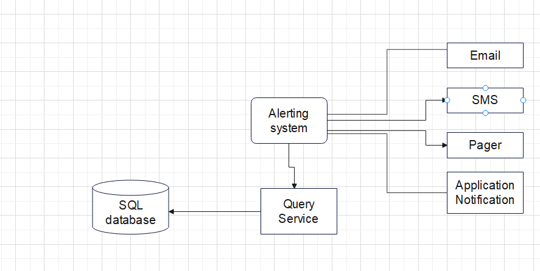 

 ## 7) Device Communication Diagram
 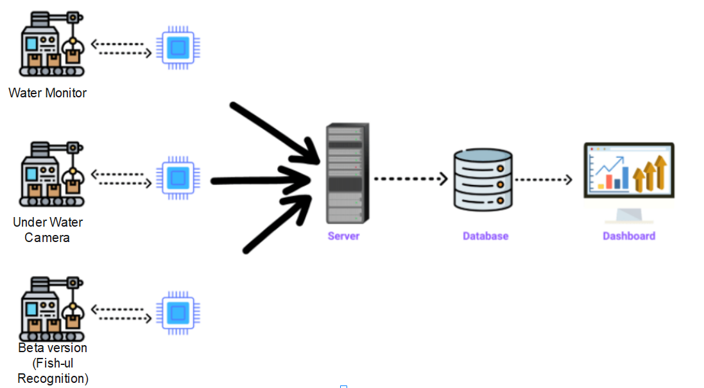 

 ## 8) Communication Diagram
 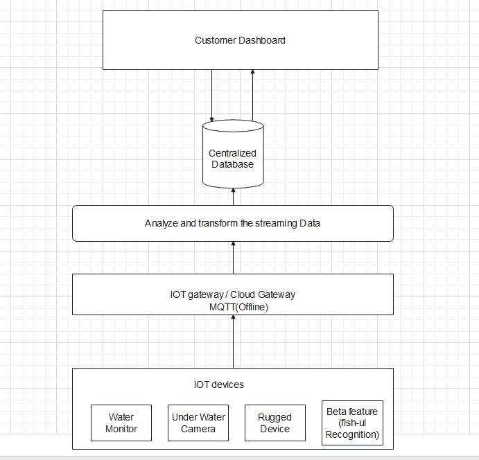 

 ## 9) Application Architecture Diagram
 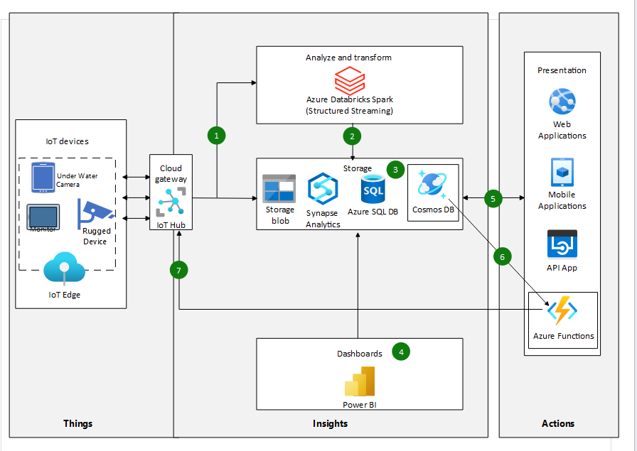 

 ## 10) Use Case 3 Diagram
 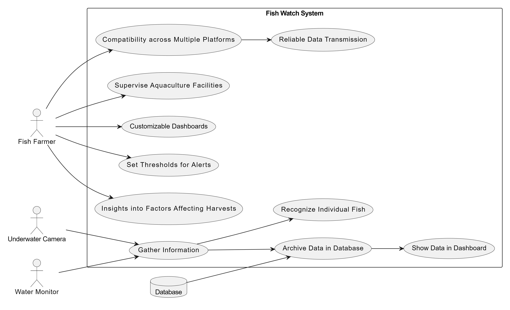 

  ## 11) Application Diagram
 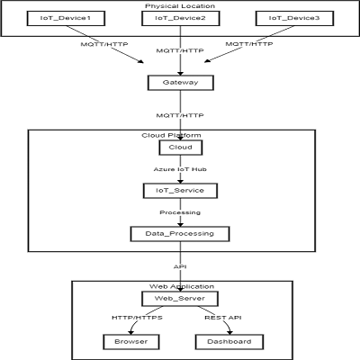 

   ## 12) Use Case 4 Diagram
 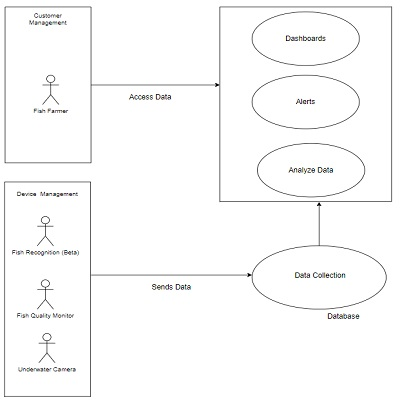 

   ## 13) Requirement Capture Diagram
 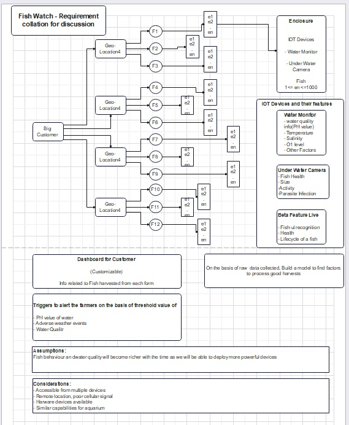 