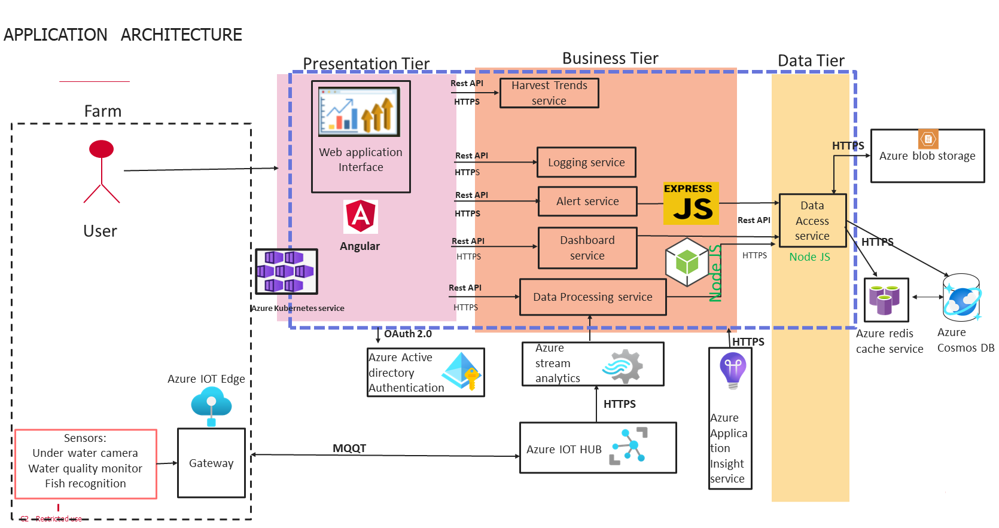

# Application Architecture

Our vision vision for the Fish Watch application revolves around creating a holistic solution that revolutionizes fish farming management. At its core lies a commitment to user-centric design, ensuring that farmers can easily navigate the platform and access valuable insights tailored to their specific needs. Real-time monitoring and alerts are prioritized, leveraging advanced technologies like water monitors, underwater cameras, and fish-ual recognition to provide timely notifications about water quality and fish health. Scalability and flexibility are key considerations, with the platform designed to accommodate farms of all sizes and seamlessly integrate with existing hardware. Accessibility is ensured even in remote locations with poor connectivity, while the potential for cross-industry expansion underscores the platform's versatility. Through continuous improvement and innovation, the developer aims to empower fish farmers with a comprehensive toolset that not only addresses their current challenges but also anticipates and adapts to future needs in the aquaculture industry.

## Choice of Technical Stack: Understanding Our Technological Foundations

* ### Azure IoT Edge on Gateway:

Azure IoT Edge provides edge computing capabilities, allowing for data preprocessing and filtering at the gateway level. This helps reduce bandwidth usage and latency by processing data closer to the source, enhancing the overall efficiency of the IoT solution.

* ### Azure IoT Hub:

Azure IoT Hub serves as the central message hub for bi-directional communication between IoT devices and the cloud. It provides scalable device management, secure communication, and seamless integration with other Azure services, making it an ideal choice for managing and monitoring IoT device connectivity.

* ### Azure Stream Analytics Service (SAS):

Azure Stream Analytics enables real-time data processing and analytics on streaming data from IoT devices. It offers a SQL-like query language for easy data transformation and analysis, allowing for the extraction of valuable insights from the continuous stream of data generated by the FishWatch system.

* ### Node.js with Express Framework:

Node.js is a lightweight, event-driven JavaScript runtime, well-suited for building scalable, real-time applications. The Express framework provides a minimalist, yet powerful web application framework for Node.js, enabling rapid development of RESTful APIs and web services required for the microservices architecture of the FishWatch system.

* ### Microservices (Data Processing, Dashboard, Alert, Logging, Harvest Trend, Data Access):

   Microservices architecture promotes modularity, scalability, and flexibility by breaking down the application into smaller, independently deployable services. Each microservice focuses on a specific business functionality, allowing for better maintainability, fault isolation, and scalability of the FishWatch system.

* ### Azure Redis Cache:

Azure Redis Cache provides an in-memory data store for caching frequently accessed data, improving the performance and scalability of the FishWatch system. By caching data closer to the application, Redis Cache reduces latency and offloads the load on backend data stores, enhancing overall system responsiveness.

* ### Azure Blob Storage:

Azure Blob Storage offers scalable, cost-effective storage for unstructured data such as images, videos, and documents generated by the FishWatch system. It provides high availability, durability, and seamless integration with other Azure services, making it an ideal choice for storing and managing large volumes of data.

* ### Azure Cosmos DB:

Azure Cosmos DB is a globally distributed, multi-model database service designed for building highly responsive and scalable applications. It offers flexible data models, automatic scaling, and low-latency access to data, making it suitable for storing and querying diverse data types generated by the FishWatch system while ensuring high availability and fault tolerance.

* ### Angular for front end development

Offers a robust framework for building dynamic, single-page applications.
Provides a rich set of features, including data binding, dependency injection, and routing.
Enables efficient development, testing, and maintenance of complex user interfaces.
Ensures a seamless user experience with responsive design and cross-platform compatibility

* ### Azure Kubernetes Service (AKS)

Selected for orchestration: Simplifies container management and scaling.
Ensures high availability, fault tolerance, and resource optimization

* ### Azure Application Insights

It is utilized in the architecture to enable comprehensive monitoring and diagnostics of microservices. It offers real-time insights into application performance, proactive issue detection, customizable alerts, and powerful diagnostic tools, empowering continuous optimization and ensuring high reliability of the application.

